# StreamYard

## Visão Geral

Um estúdio de transmissão virtual no seu navegador. Ele permite que os usuários façam lives com mais de uma pessoa ao mesmo tempo, compartilhe sua tela e muito mais.  A ferramenta transmite os vídeos nas principais redes sociais, como Facebook, YouTube, LinkedIn, Twitch e Periscope e outras plataformas.

### Criar conta no StreamYard

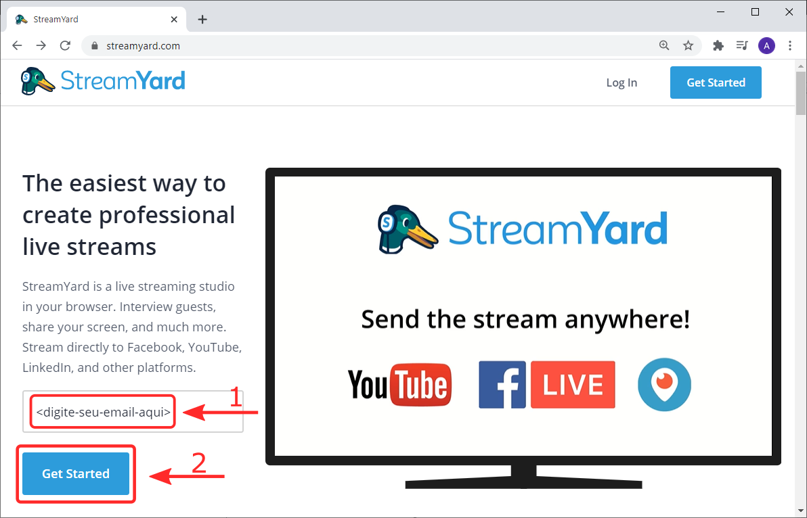

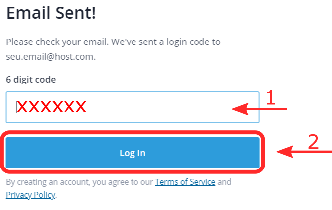

### Fazer o login

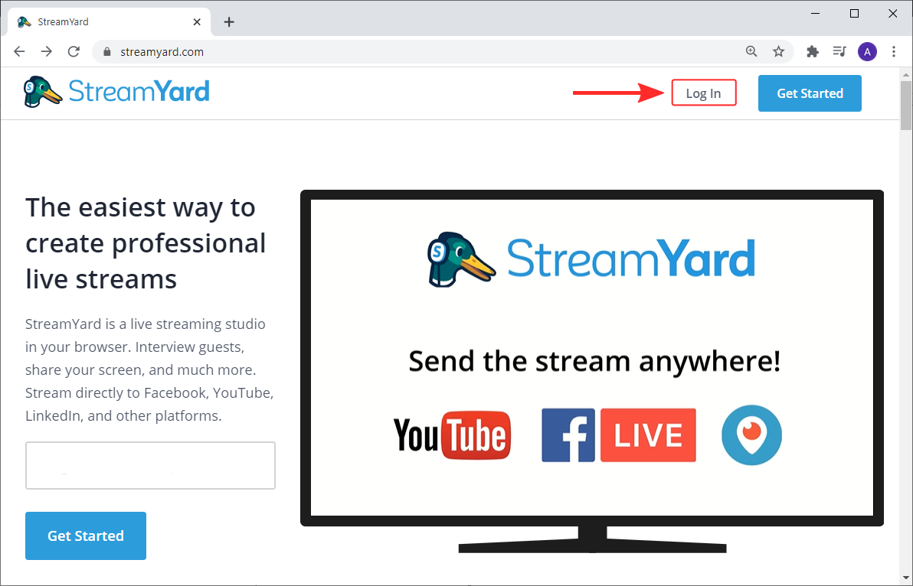

### Adicionar conta da rede social

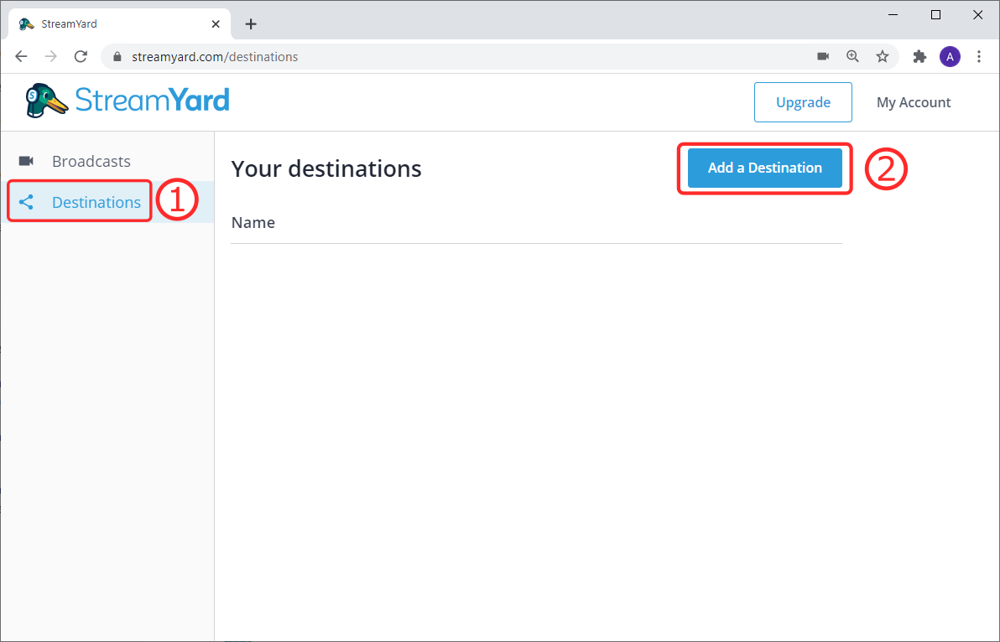

### Criar um estúdio para a transmissão

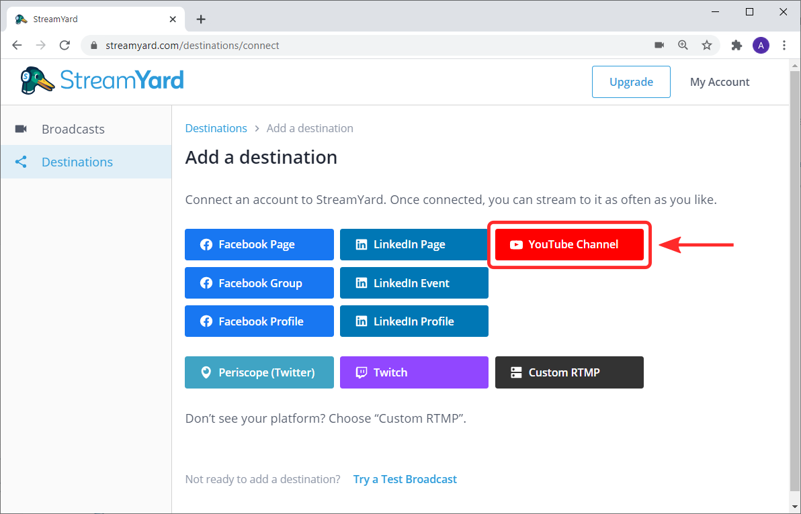

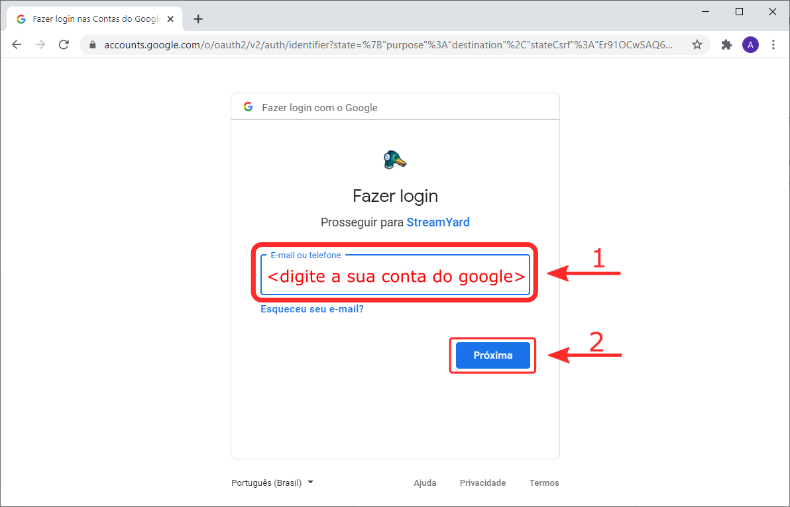

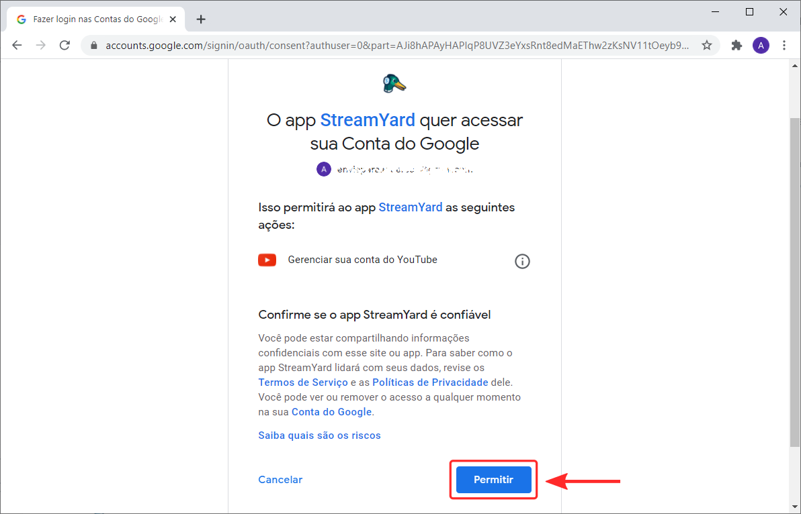

Preparando um estúdio de transmissão ao vivo

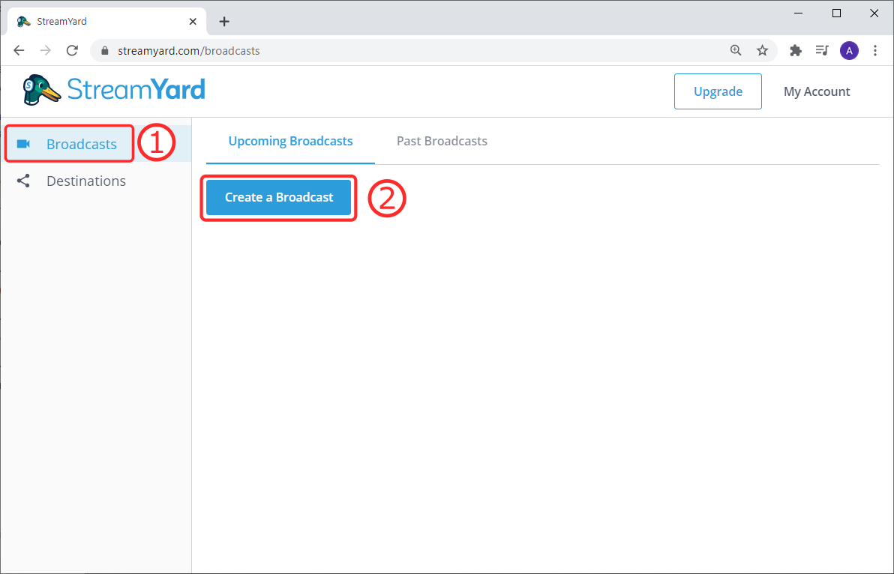

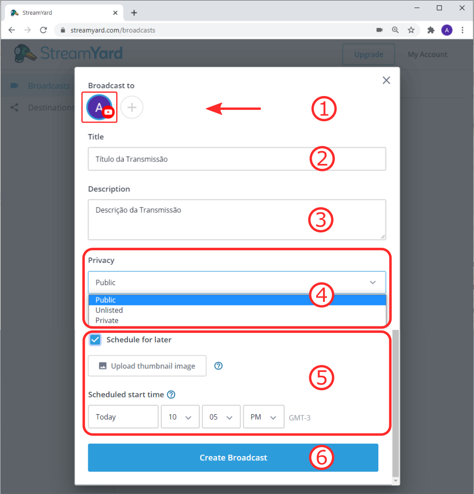

#### Item **4** - Configurações de privacidade

#### `Vídeos públicos (Public)`

 Os vídeos públicos podem ser **vistos por qualquer pessoa no YouTube.** **Eles também podem ser compartilhados com qualquer usuário da plataforma**. Esse tipo de conteúdo é postado no seu canal após o envio e aparece nos resultados da pesquisa e nas listas de vídeos relacionados.  

#### `Vídeos não listados (Unlisted)`

Playlists e vídeos não listados podem ser **vistos e compartilhados por qualquer usuário com um link de acesso**. Esse tipo de conteúdo não aparecerá na guia **Vídeos** da página do seu canal. Ele também não será exibido nos resultados de pesquisa do YouTube, a menos que alguém adicione seu vídeo não listado a uma playlist pública.  

#### `Vídeos privados (Private)`

 Playlists e vídeos privados podem ser **vistos apenas por você e pelos usuários a quem você der acesso**. Seu conteúdo privado não aparecerá na guia **Vídeos** da página do seu canal. Ele também não será exibido nos resultados de pesquisa do YouTube. Os sistemas da plataforma e revisores humanos podem analisar os vídeos privados para conferir a adequação para publicidade e se há violações de direitos autorais. Além disso, outros mecanismos de prevenção contra abusos são usados nesse processo.  
Você pode compartilhar o URL de vídeos não listados com outras pessoas. Os usuários com quem você compartilhar o vídeo não precisarão ter uma Conta do Google para assistir o conteúdo. Além disso, qualquer pessoa que tenha o link poderá compartilhar o vídeo.

| Recurso | Privado | Não listado | Público |
| :--- | :---: | :---: | :---: |
| O URL pode ser compartilhado | Não | Sim | Sim |
| Pode ser adicionado a uma seção do canal | Não | Sim | Sim |
| Aparece na pesquisa, nos vídeos relacionados e nas recomendações | Não | Não | Sim |
| É postado no seu canal | Não | Não | Sim |
| Aparece no feed dos inscritos | Não | Não | Sim |
| Aceita comentários | Não | Sim | Sim |

#### Item **5** - Programar uma transmissão

Na programação de uma transmissão futura pode-se já definir qual imagem de capa do vídeo \(opcional\).  
Também é definido qual data e hora de início da programação.

#### Item 1 - Configuração de Áudio e e Vídeo

Nesta parte habilitamos o Microfone e o Vídeo. Também podem ser realizadas configurações personalizadas para cada um desses itens.

#### Item 2 - Definição do nome

Aqui se define qual vai ser o nome que será exibida na transmissão para o participante.

#### Item 1 - Tela de visualização \(Preview\)

Este espaço mostra o que será transmitido

#### Item 2 - Seletor de cenas

#### Item 3 - Seletor de imagens

#### Item 4 - Configuração Gerais



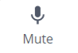

Habilita/desabilita o microfone



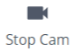

Habilita e desabilita o vídeo



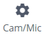

Configurações extras de vídeo e microfone



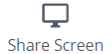

Compartilha o que estiver no monitor ou somente uma janela. Para mais informações acesse o link abaixo:





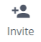

Disponibiliza um link para ser passado para os participantes da transmissão



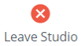

Sai do estúdio da transmissão



#### Item 5 - Controles da Live



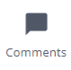



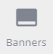



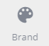



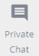



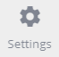

O mesmo que Cam/Mic  explicado acima




#### Item 6 - GO Live

Acionando este botão a transmissão ao vivo começa sem transmitida

