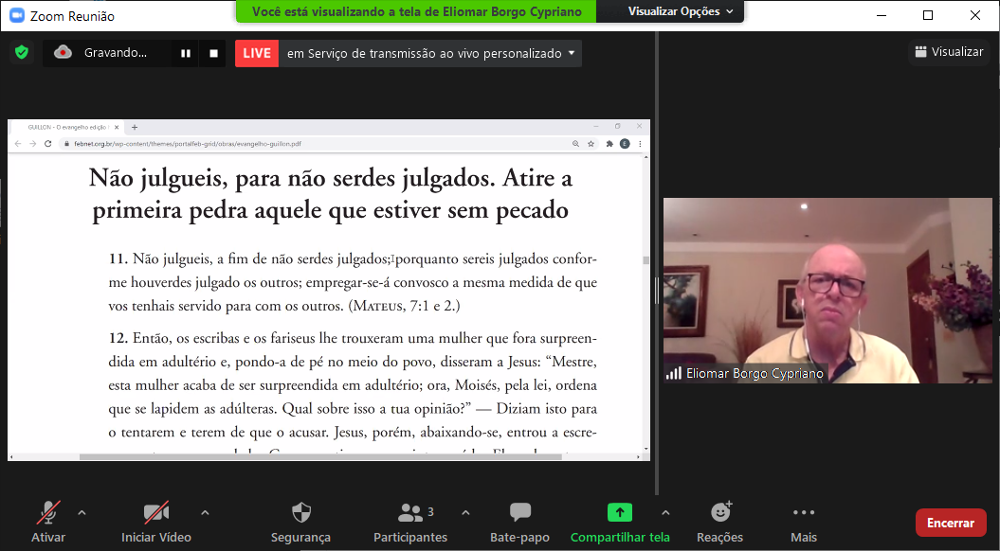
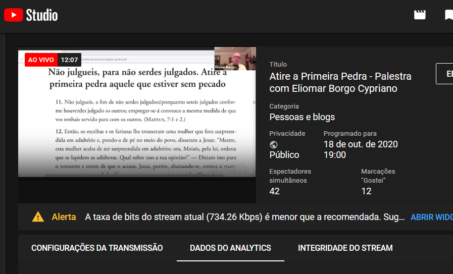

# Zoom Meetings \(a fazer\)

## Visão Geral

 O [Zoom Meetings](https://zoom.us) é uma ferramenta de videoconferência voltada para ambientes corporativos que suporta reuniões com até 500 participantes e 10 mil expectadores no modo webinar. Muito utilizada no meio empresarial, a solução se destaca pela estabilidade da conexão em qualquer dispositivo. O serviço funciona via navegador e em aplicativos para Windows, macOS, Linux, iPhone \(iOS\) e Android. Há também compatibilidade com serviço dial-in, que permite participar apenas com áudio por meio de ligação telefônica convencional.

## Como criar uma transmissão online pelo Youtube

Existe 2 formas de se realizar a transmissão online pelo Youtube:

### 1\) Transmitir uma reunião imediatamente \(Fácil\)

#### 1.1\) Habilitar Função de transmissão ao vivo no Zoom

1.2

### 2\) Transmitir uma reunião de forma agendada \(Avançado\)

#### 2.1\) Habilitar Função de transmissão ao vivo no Zoom \(vide item 1.1\)

Agendar uma transmissão ao vivo no youtube

